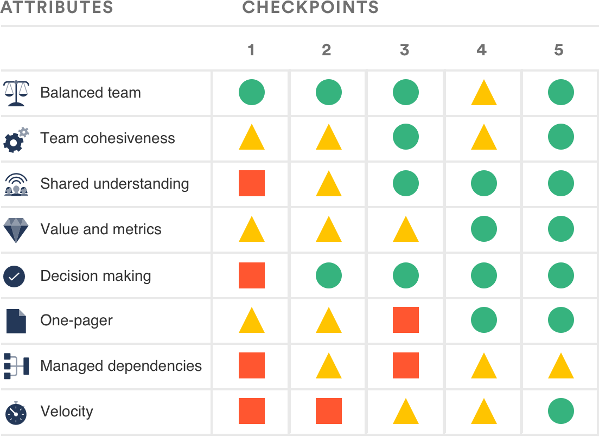

领导团队健康监测
==
对于领导团队的健康监测, 选择一个共同的使命或目标, 并评估您的团队的健康与此。不要自己打分或让团队给您汇报, 这是关于领导小组集体的。

### 使用这个健康监视器...

了解作为一个领导团队自己的优势和劣势。

识别您的团队应该运行（以及为什么）。

### 我需要这……为什么？
作为一个领导团队, 您是一个倍增器。有很多人在寻找您的灵感和方向。您所做的工作是有远见的、战略性的, 而不是战术性的、和操作性的。您的领导团队可能包括高级执行官, 他们负责在今年将客户参与度提高30%。也可能是来自整个公司的基层领导的集合, 他们的团队正在将您的产品推向新的国家。

在过去的几年中, 我们观察到健康的领导团队中共有的八个属性。如果您愿意，这个健康监测是一个机会让您的团队得到一个团队生命活力的报告。这样，您可以运行其他游戏，改变您的工作方式, 以增强您的薄弱环节, 同时通过快速检查以跟踪您的进展。

虽然领导团队健康监测在项目启动时运行最为有效，但您也可以随时运行。 作为长期的举措, 我们建议每三月运行一次全面的领导健康监测游戏, 每2周进行一次快速检查。

### 谁应该参与？
带上您的领导团队的所有成员。请记住: 这些人负责指导这项计划所涉及的日常工作, 而不是执行具体任务的人员。

|  |  |  |  |
| :--------------------: | :-----------------------: | :------------------: | :-------------------------------: |
|参与者|准备时间|持续时间|难度|
|整个团队|5分钟|1小时|中等|

# 召开研讨会
**健康检查研讨会和检查站是一次深刻的回顾，必须100%投入，需要确保电脑关闭、手机关闭等等。如果您仅把它作为一次  "是的, 检查那个盒子!" 活动, 您不如把时间花在其他地方。**

>### 材料
>| Whiteboard |
>| --- |
>|Confluence Server or Confluence Cloud的健康监测模板|
>|红色，黄色，绿色的马克笔或者钢笔|
>|大显示器|
>|计时器|
>|橡胶鸡|

# 准备
在白板上绘制[健康监视器表格](./领导团队健康检测表格.md), 或将其打印并作为讲义分发。选择团队中的一个成员来担当主持人的角色, 或者邀请团队外部的人员作为主持。

# 第一步

## 设置舞台 (10 mins)
### 欢迎
首先, 感谢您的团队安排时间参加会议。提醒他们, 您正在运行健康监测评估，以反思团队是如何在一起工作的。你会直接地、诚实地、直击痛点地找出团队哪些地方没有很好的运转。尽管你会发现一些好的东西，并击掌相庆，但这并不会一帆风顺。你会发现团队的劣势，并想法来使之变强。

你将严格按照正在开展的工作来评估团队的健康状况。 在接下来的一个小时里，没有对错的答案，每个人的意见都是平等的。

### 介绍健康的领导团队的8个属性
在屏幕上显示健康领导团队的[八个属性](./领导团队健康检测表格.md)，并给你的团队一个机会通读他们。 （标题类似于项目团队的标题，但定义是针对领导团队定制的。）阐述所有紧要的问题，但不要过分强调，因为您希望尽快参与活动和讨论。

# 第二步
## 小组评估(20分钟)
将团队分成两组，每组最好混合不同技能，经验和风格，以鼓励不同的想法。 把小组放在房间的两端。 请注意，如果您的团队超过八人，则可能需要分成三组。

让小组考虑健康领导团队的八个属性，使用健康监测表格（下载它或使用Confluence蓝图）,用红色，黄色或绿色来评估团队的各个属性。 你可以随意使用红色，黄色和绿色。 凭你直觉，不用担心每种颜色的标准 - 那只会分散注意力，并有风险将其变成一个复选框练习。

参考每个属性的定义以指导您的评估，对于每一个评分，小组需要达成一个意见。

抵制现在解决问题的诱惑, 专注到发现问题。在进入整个团队讨论之前, 确保每个人都有发言权, 并有机会单独为他们的团队评分。

以下是监测表格可能的外观:

# 第三步
## 全员讨论 (20 分钟)
把整个团队重新组合起来，并且把每个团队的评级并排放在一起，或者把它们合并到同一个表格上，如果这更容易的话。让整个团队围成一个半圆形。逐个浏览每个属性，并要求团队解释他们的红色/黄色/绿色评级。

例如，如果一个团队将“平衡团队”评为红色，而另一个团队评价为“绿色”，那就深入挖掘并尝试达成共识。 主持人的工作是（温和，恭敬地）挑战团队成员，梳理评分之间的差异。 更多问“为什么？” 怎么？” 。

再次强调, 不要试图解决问题。

# 第四步
## 聚焦一个属性，明确待办项，明确责任人 (10 分钟)
要求团队共同想出一个关注的属性。 确定是：一个。 并钉住它！

让团队讲出将红色或黄色向绿色移动的方法。确保它们是可操作的、特定的和可测量的。

将待办项添加到您的会议记录，并有明确的截止日期，并将其分配给小组成员。

确保团队健康监测表格有纸质存档或者放到Confluence页面上。

## 检查点
最后, 统一检查点的节奏。在追求团队共同使命时, 很容易在日常琐事中迷失方向。我们忘记了每个团队成员的经验和他们的需求有所不同。这就是检查点如此重要的原因: 领导团队的健康状况表明了你成功的机会。

我们还建议在两到三个月左右时间安排另一个完整的健康监测研讨。

# 跟进
为健康监测检查点设置一个常规节奏。 你的红色和黄色是否向绿色移动？ 有没有你的绿色溜进红色？ 定期检查有助于保持高速发展，并在问题发生前消除问题。

有些团队将检查点整合到现有的团队仪式中，如每周的团队会议。 其他一些团队会在定期冲刺回顾会或站会完成一个检查点。 但是，如果需要，您可以单独安排检查点。

检查点时, 请调出您的健康监视器表格。让整个团队评估他们是如何使用相同的红/黄/绿分级来评估每个属性的。

在整个运行状况监视会话期间, 特别注意您选择关注的属性。当它变绿的时候, 选择一个新的焦点, 并寻找将会有帮助的剧本。记住: 剧本是以不同的方式去完成你的日常工作, 这意味着你可以运行他们, 即使你没有挣扎。预防护理工作适用于团队就像它适用于我们的身体一样!
